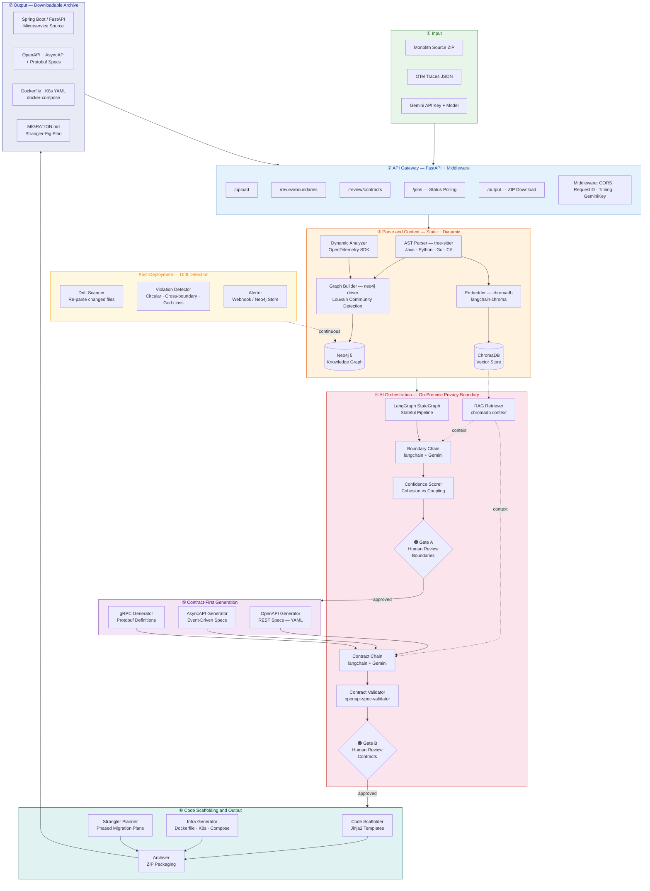
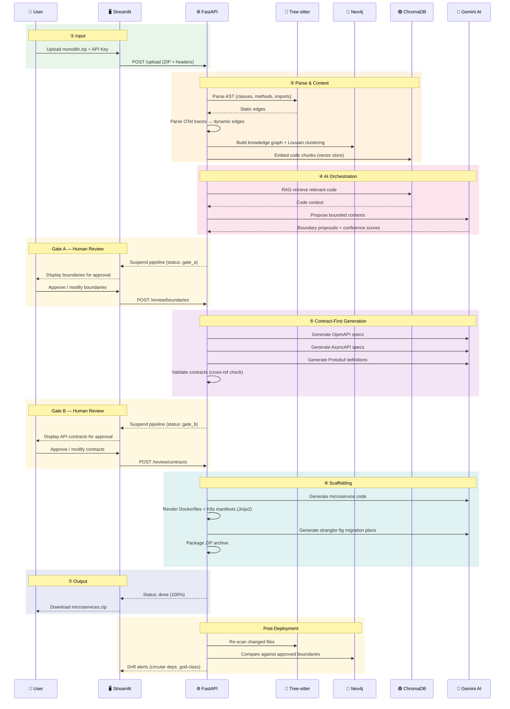

# 🔨 MonolithBreaker — AI-Powered Legacy Modernisation

<div align="center">


**An intelligent platform that decomposes legacy monolithic applications into deployable microservices using static AST analysis, dynamic runtime data, a local knowledge graph, and Google Gemini.**

[Features](#-features) • [Architecture](#-architecture) • [Pipeline](#-pipeline-flow) • [Installation](#-installation) • [Usage](#-usage) • [Docker](#-docker)

</div>

---

## ✨ Features

| Feature | Description |
|---------|-------------|
| 🧩 **Intelligent Decomposition** | Automatically detects Bounded Contexts using Gemini AI and Louvain graph clustering |
| 📊 **Deep Code Analysis** | Parses Java/Python/Go/C# ASTs with Tree-sitter to build a comprehensive dependency graph |
| 🕵️ **Dynamic Tracing** | Ingests OpenTelemetry (OTel) traces to understand actual runtime call patterns |
| 🧑‍💻 **Human-in-the-Loop Gates** | Review, modify, and approve microservice boundaries and API contracts before code generation |
| 📜 **Contract-First Generation** | Generates OpenAPI, AsyncAPI, and gRPC Protobuf specs *before* writing any service code |
| 🏗️ **End-to-End Scaffolding** | Generates Spring Boot / FastAPI code, Dockerfiles, K8s manifests, and Strangler-Fig migration plans |
| 🛡️ **Post-Deployment Drift Detection** | Monitors ongoing monolith commits to alert on circular deps, cross-boundary calls, and god-class regrowth |

---

## 🏗️ Architecture



---

## 🔄 Pipeline Flow



---

## 📁 Project Structure

```text
MonolithBreaker/
├── docker-compose.yml              # 🐳 Full-stack orchestration (App + Neo4j + OTel)
├── Dockerfile                      # 🐳 Backend container image
├── pyproject.toml                  # 📦 Dependencies managed by uv
├── Makefile                        # 🛠️ Dev shortcuts
│
├── frontend/                       # 🖥️ Streamlit Application
│   ├── app.py                      #    Landing page + sidebar config
│   └── pages/
│       ├── 01_upload.py            #    ZIP upload + pipeline trigger
│       ├── 02_progress.py          #    Real-time job status polling
│       ├── 03_boundary_review.py   #    Gate A — approve boundaries
│       ├── 04_contract_review.py   #    Gate B — approve contracts
│       ├── 05_download.py          #    Output archive download
│       └── 06_drift_dashboard.py   #    Post-deploy violation alerts
│
├── backend/                        # ⚙️ FastAPI Application
│   ├── main.py                     #    App factory + middleware registration
│   ├── config.py                   #    Pydantic Settings (env-driven)
│   │
│   ├── api/                        #    ② API Gateway Layer
│   │   ├── middleware.py           #       CORS · RequestID · Timing · GeminiKey
│   │   ├── schemas.py              #       Pydantic models + enums
│   │   └── routes/
│   │       ├── upload.py           #       POST /upload
│   │       ├── jobs.py             #       GET  /jobs/{id}
│   │       ├── review.py           #       POST /review/boundaries|contracts
│   │       ├── output.py           #       GET  /output/{id}
│   │       └── drift.py            #       GET  /drift/{id}
│   │
│   ├── ingestion/                  #    ③ Parse & Context Layer
│   │   ├── ast_parser.py           #       Tree-sitter multi-lang AST parsing
│   │   ├── language_registry.py    #       Parser registry (Java/Python/Go/C#)
│   │   ├── dynamic_analyzer.py     #       OTel trace → dynamic call edges
│   │   ├── graph_builder.py        #       Neo4j graph + Louvain clustering
│   │   ├── embedder.py             #       ChromaDB code embeddings
│   │   └── job_runner.py           #       Pipeline entry point + job store
│   │
│   ├── db/                         #    Data Layer
│   │   ├── neo4j_client.py         #       Neo4j async driver wrapper
│   │   └── chroma_client.py        #       ChromaDB persistent client
│   │
│   ├── ai/                         #    ④ AI Orchestration Layer
│   │   ├── orchestrator.py         #       LangGraph StateGraph pipeline
│   │   ├── llm_client.py           #       Gemini LLM client (langchain-google-genai)
│   │   ├── rag_retriever.py        #       RAG context from ChromaDB
│   │   ├── confidence_scorer.py    #       Cohesion / coupling scoring
│   │   ├── chains/
│   │   │   ├── boundary_chain.py   #       Bounded context detection
│   │   │   ├── contract_chain.py   #       API contract generation
│   │   │   ├── code_chain.py       #       Service code extraction
│   │   │   └── strangler_chain.py  #       Migration plan generation
│   │   └── prompts/                #       Prompt templates
│   │
│   ├── contracts/                  #    ⑤ Contract-First Generation
│   │   ├── openapi_generator.py    #       REST OpenAPI 3.0 YAML
│   │   ├── asyncapi_generator.py   #       Event-driven AsyncAPI YAML
│   │   ├── grpc_generator.py       #       gRPC Protobuf definitions
│   │   └── validator.py            #       Cross-reference validation
│   │
│   ├── scaffolding/                #    ⑥ Code Scaffolding
│   │   ├── code_scaffolder.py      #       Jinja2 template renderer
│   │   ├── infra_generator.py      #       Dockerfile + K8s + Compose
│   │   ├── strangler_planner.py    #       Strangler-fig migration plans
│   │   ├── archiver.py             #       ZIP packaging
│   │   └── templates/              #       Jinja2 templates (Spring Boot / FastAPI)
│   │
│   └── drift/                      #    Post-Deployment Layer
│       ├── scanner.py              #       Re-parse changed source files
│       ├── detector.py             #       Violation detection engine
│       └── alerter.py              #       Webhook + Neo4j alert storage
│
├── infra/                          # 🏗️ Infrastructure
│   └── otel/
│       └── collector-config.yaml   #    OpenTelemetry Collector config
│
└── data/                           # 📂 Runtime Data (Docker volume)
    ├── uploads/                    #    Uploaded ZIP files
    ├── outputs/                    #    Generated microservice archives
    └── chroma/                     #    ChromaDB persistent storage
```

---

## 🛠️ Tech Stack

| Layer | Technology | Purpose |
|-------|------------|---------|
| **② Gateway** | `FastAPI` `uvicorn` `Pydantic` | Async REST API with schema validation |
| **③ Static Parse** | `tree-sitter` `tree-sitter-java` `tree-sitter-python` `tree-sitter-go` `tree-sitter-c-sharp` | Multi-language AST extraction |
| **③ Dynamic Parse** | `opentelemetry-sdk` | Runtime trace ingestion |
| **③ Graph** | `neo4j` (driver) + Neo4j 5 GDS | Knowledge graph + Louvain clustering |
| **③ Embeddings** | `chromadb` `langchain-chroma` | Code vector search (RAG) |
| **④ Orchestration** | `langgraph` `langchain` `langchain-core` | Stateful multi-step agent pipeline |
| **④ LLM** | `langchain-google-genai` (Google Gemini) | Reasoning engine for all AI chains |
| **⑤ Contracts** | `openapi-spec-validator` `pyyaml` | Contract generation + validation |
| **⑥ Scaffolding** | `jinja2` | Template-based code and infra rendering |
| **🖥️ Frontend** | `streamlit` `streamlit-agraph` `httpx` | Interactive multi-page UI |
| **🐳 Infra** | `Docker` `Docker Compose` `OTel Collector` | Container orchestration + observability |

---

## 🚀 Installation

### Prerequisites

- Python 3.11+
- [uv](https://docs.astral.sh/uv/) (fast Python package manager)
- Docker & Docker Compose
- Gemini API Key ([Get one here](https://aistudio.google.com/app/apikey))

### Setup with uv

```bash
# Clone the repository
git clone https://github.com/aadarshpandey/MonolithBreaker.git
cd MonolithBreaker

# Install uv (if not installed)
curl -LsSf https://astral.sh/uv/install.sh | sh

# Create virtual environment and install dependencies
uv venv
source .venv/bin/activate  # Linux/Mac
# .venv\Scripts\activate   # Windows

# Install dependencies
uv sync
```

---

## ▶️ Usage

### 1. Start the Infrastructure (Neo4j & OTel)

```bash
docker compose up -d neo4j otel-collector
```

### 2. Start the Backend API

```bash
uv run uvicorn backend.main:app --reload --port 8000
```

### 3. Start the Streamlit UI

```bash
uv run streamlit run frontend/app.py
```

Open your browser at `http://localhost:8501`

### First Time Setup

1. Enter your **Gemini API Key** in the sidebar
2. Select your preferred **Gemini Model** (e.g., `gemini-2.5-flash`)
3. Navigate to **Upload** → submit your monolith ZIP
4. Monitor **Progress** → approve **Boundaries** → approve **Contracts** → **Download**

---

## 🐳 Docker

### Full Stack (Recommended)

```bash
# Build and start everything (Backend + Neo4j + OTel)
docker compose up -d --build

# View logs
docker compose logs -f app
```

### Access Points

| Service | URL |
|---------|-----|
| **Frontend UI** | `http://localhost:8501` |
| **Backend API** | `http://localhost:8000` |
| **Neo4j Browser** | `http://localhost:7474` |

---

## 🔧 Configuration

| Variable | Description | Default |
|----------|-------------|---------|
| `GOOGLE_API_KEY` | Gemini API key (or set via UI sidebar) | — |
| `GEMINI_MODEL` | Default Gemini model | `gemini-2.5-flash` |
| `NEO4J_URI` | Neo4j bolt connection | `bolt://localhost:7687` |
| `NEO4J_USER` | Neo4j username | `neo4j` |
| `NEO4J_PASSWORD` | Neo4j password | `password` |
| `UPLOAD_DIR` | Path for uploaded ZIPs | `data/uploads` |
| `OUTPUT_DIR` | Path for generated output | `data/outputs` |
| `CHROMA_PERSIST_DIR` | ChromaDB storage path | `data/chroma` |

---

## 📄 License

MIT License — feel free to use, modify, and distribute.

---

<div align="center">

**Made with ❤️ using FastAPI, LangGraph, Streamlit & Google Gemini**

[⬆ Back to top](#-monolithbreaker--ai-powered-legacy-modernisation)

</div>